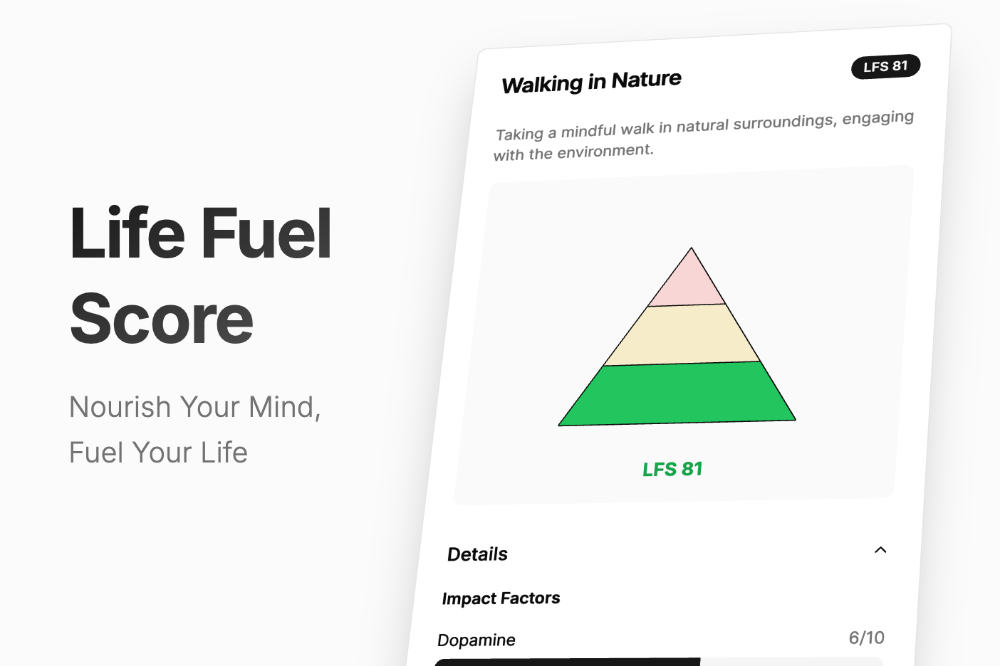

# Life Fuel Score (LFS)

*Nourish Your Mind, Fuel Your Life*

## Overview

The **Life Fuel Score (LFS)** is an initiative to evaluate and rate activities based on their impact on human well-being. By focusing on factors like dopamine release, mental health, and social connectivity, LFS aims to provide a "nutritional label" for activities, helping individuals make informed choices about how they spend their time.

## Introduction

In an age where technology and entertainment are evolving rapidly, it's becoming increasingly important to understand how our activities affect our well-being. The Life Fuel Score project seeks to:

- **Educate** individuals about the impact of different activities on their mental and social health.
- **Encourage** mindful choices that promote long-term happiness and health.
- **Collaborate** with researchers and enthusiasts to refine the scoring system based on scientific data.

## What's In Here?

At this point the project is very much in idea phase.

There's an initial idea of a label design as a pyramid (like the food pyramid) and a basic web app with sample activities.

The next step will be to create a scientifically sound scoring system based on factors like dopamine release, mental health, and social connectivity.

The web app in here will let you play around with the algorithm and see its effect on various activities. The website is live on: https://life-fuel-score.netlify.app

## Contributing

We welcome contributions from everyone! Please see the [CONTRIBUTING.md](CONTRIBUTING.md) file for guidelines on how to get involved.

## License

This project is licensed under the MIT License. See the [LICENSE](LICENSE) file for details.

## Contact

- **Project Lead:** Marcel Samyn
- **LinkedIn:** [Marcel's LinkedIn Profile](https://www.linkedin.com/in/marcelsamyn)

---

*Let's work together to fuel our lives with activities that bring lasting joy and well-being.*